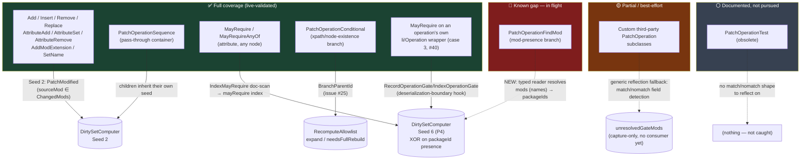

# RimWorld PatchOperation catalogue vs. our dirty-set coverage

Source: the RimWorld wiki's PatchOperations reference
(`/home/deck/Developer/RimWorldMods/PatchOperations - RimWorld Wiki.html`), cross-checked against
`Verse.PatchOperation*` via the decompiler. Written while scoping issue #40 (`PatchOperationFindMod`
gap) so we have one place that maps *every* RimWorld patch construct to what our incremental
dirty-set pipeline (`Source/Gagarin/Core/Incremental/`) actually proves safe for it today.

"Full" here means: a changed def under this construct is provably caught by some seed/mechanism,
backed by a live-validated fixture (`TestMods/run_test.sh --expect-*`) — not just "we capture the
edge in `DependencyGraph.json`." Capturing an edge is necessary but not sufficient; the seed has to
actually consume it.

## Catalogue

| # | Operation | Shape | Coverage | Mechanism |
|---|---|---|---|---|
| 1 | `PatchOperationAdd` | XML mutation on xpath match | **Full** | Seed 2 (`PatchModified`) — direct patch edge, `sourceMod ∈ ChangedMods` |
| 2 | `PatchOperationInsert` | XML mutation (sibling insert) | **Full** | Seed 2 |
| 3 | `PatchOperationRemove` | XML mutation (delete) | **Full** | Seed 2 |
| 4 | `PatchOperationReplace` | XML mutation (replace) | **Full** | Seed 2 |
| 5 | `PatchOperationAttributeAdd` | Attribute mutation | **Full** | Seed 2 |
| 6 | `PatchOperationAttributeSet` | Attribute mutation | **Full** | Seed 2 |
| 7 | `PatchOperationAttributeRemove` | Attribute mutation | **Full** | Seed 2 |
| 8 | `PatchOperationAddModExtension` | XML mutation (adds `<modExtensions>` `<li>`) | **Full** | Seed 2 |
| 9 | `PatchOperationSetName` | XML mutation (renames a node) | **Full** | Seed 2 |
| 10 | `PatchOperationSequence` | Ordered container, aborts on first child failure | **Full (pass-through)** | Not a mutation itself; children get individual `PatchIdWalker` ids (`.operations[i]`) and are covered by whichever seed applies to them. If the *changed* mod owns the sequence and a member op can't be safely narrowed, `SubDocExpander` sets `needsFullRebuild` (issue #25 CASE 8) — safe, not silent. |
| 11 | `PatchOperationFindMod` | **Branch**: tests mod **display name** presence (`ModLister.HasActiveModWithName`, not packageId) → `match`/`nomatch` | **Full for the dirty-set gate, live-validated; recompute is fallback-safe** | `FindModCapture`/`ProvenanceRecorder.IndexFindMod` resolves `mods` (names) → packageIds, feeds the *same* `mayRequire` index Seed 6 already drains — no new seed needed, reuses P4's XOR check. `run_test.sh --expect-findmod` (2026-07-02) confirms: `mayRequire["joof.testharness.gate"] = ["ThingDef/TC_FM_Host"]` captured correctly, dirty-set gate passes (`nonDirtyMismatches=0`, `seeds.mayRequire=1`). Recompute currently falls back to full rebuild (`RecomputeAllowlist`/`SubDocExpander` don't yet recognize `PatchOperationFindMod` as an allowlist-safe branch type) — safe, not silent, but not yet narrowed. **Note:** confirmed NOT to be the root cause of issue #40's original real-world repro (`oppey.eyegenes2`) — that turned out to be `LoadFolders.xml` conditional folder inclusion, a different/earlier mechanism (see the update below). This fix is independently valid for mods that do use `PatchOperationFindMod`. |
| 12 | `PatchOperationConditional` | **Branch**: tests xpath/node existence → `match`/`nomatch` | **Full for the validated case** | `RecomputeAllowlist.BranchParentId` (issue #25, CASE 7 same-def-nesting / CASE 8 sequence-nesting) resolves the leaf's *immediate* gating conditional and expands the allowlist / forces fallback correctly, live-validated (`--expect-nested-conditional`, `--expect-nested-in-sequence`). **Open nuance** (not yet live-tested): if the tested xpath's target existed only because of a *third*, unrelated mod that gets removed entirely (mirroring the #40 shape but for a content-existence test instead of a mod-presence test), it's unconfirmed whether the allowlist mechanism still catches it — worth a targeted live fixture later. |
| 13 | `PatchOperationTest` (obsolete) | No `match`/`nomatch` — flips its own success/failure, historically paired with `<success>Invert</success>` inside a `Sequence` to fake conditional behavior pre-`Conditional` | **Not supported, documented gap** | No branch shape to hook (nothing to reflect for). Rare/deprecated per the wiki itself; not pursued. |
| — | `MayRequire` / `MayRequireAnyOf` (attribute, usable on any node incl. inside a `Sequence`, not an operation type) | Declarative gate, survives in the patched tree regardless of runtime evaluation | **Full, live-validated** | Seed 6 / P4 (`IndexMayRequire` doc-scan → `mayRequire` index → XOR on packageId presence). `run_test.sh --expect-mayrequire` passes both the dirty-set gate and the recompute gate. |
| — | `MayRequire` / `MayRequireAnyOf` directly on a `PatchOperation`'s own `<li>`/`<Operation>` wrapper element (issue #40 case 3) | Declarative gate, but consumed by RimWorld's generic list deserializer *before* the `PatchOperation` object is constructed — nothing on `Verse.PatchOperation` stores it | **Full for the dirty-set gate, live-validated (2026-07-16)** | Capture (`DirectXmlToObject_Patch.cs`'s `ModContentPack_LoadPatches_GateCapture_Patch`/`DirectXmlToObject_GetObjectFromXmlMethod_GateCapture_Patch`, commits `a0127ea`/`3d4d3a0`) hooks the XML-to-object deserialization boundary itself and stashes the gate in `pendingOperationGates`, drained into the same `mayRequire` index Seed 6 already consumes — same reused-XOR-check pattern as `PatchOperationFindMod`. This mechanism existed but was silently zeroed by an ordering bug: `ProvenanceRecorder.Reset()` (called from `ApplyPatches_Patch.Prefix`) cleared `pendingOperationGates` *after* `LoadedModManager.ErrorCheckPatches()` had already triggered every mod's lazy `LoadPatches()` and populated it for the current load — discarding every stash before `IndexOperationGate` ever drained it, for every mod using this shape, on every load. Fixed by splitting the clear into `ResetPendingOperationGates()`, called instead from the earlier `TKeySystem_Parse_Patch.Postfix` hook. `run_test.sh --expect-opgate` is the dedicated regression fixture (see "Issue #40 update 3" below); recompute is fallback-safe (the op lives in a `PatchOperationSequence`), not yet narrowed. |
| — | Custom third-party `PatchOperation` subclasses (XML Extensions, CE's `PatchOperationMakeGunCECompatible`, `PatchOperationAddOrReplace`, etc.) | Arbitrary `ApplyWorker`; no guaranteed field convention | **Partial, best-effort** | Plain-mutation custom ops that ultimately call the normal `SelectNodes`/`Apply` plumbing are covered like 1-9. Branching custom ops that happen to follow the `match`/`nomatch` field-naming convention get *capture-only* coverage from the new generic reflection fallback (part of the #40 fix) — flagged into `unresolvedGateMods`, no consumer/seed wired yet. Anything that mutates the tree without going through the hooked call path at all (e.g. constructing XML nodes in code without `SelectNodes`) is invisible — this is exactly the class issue #26's `riskyMods`/invisible-op audit exists to bound, not eliminate. |

## Coverage diagram



## Issue #40 update (2026-07-02): root cause was NOT `PatchOperationFindMod`

The live repro (`run_test.sh --modlist-verbatim=modlists/realmix-baseline.txt
--remove=nals.facialanimation,nals.facialanimationexperimentals`) was re-run **after** the
`PatchOperationFindMod` capture fix (`FindModCapture.cs` / `ProvenanceRecorder.IndexFindMod`) and
the gate still fails identically: `nonDirtyMismatches=66`, the same 33 `GeneDef`/
`FacialAnimation.EyeballColorDef` pairs owned by `oppey.eyegenes2`.

Direct inspection of `oppey.eyegenes2`'s actual mod files (workshop id `3751293981`) found the
real mechanism is **`LoadFolders.xml` conditional folder inclusion**, not `PatchOperationFindMod`:

```xml
<li IfModActiveAll="Nals.FacialAnimation,VanillaExpanded.VTEXE.FacialAnims,Oppey.EyeGenes2"
    IfModNotActive="lucius.eyegenes3">1.6_VTE_EyeGenes2</li>
```

The 34-`PatchOperationRemove` sequence (patch id `oppey.eyegenes2#15.operations[0..33]`,
`Patches/ZZZ_EyeGenes2_RemoveTeratoLids.xml`) lives entirely inside the `1.6_VTE_EyeGenes2/`
folder. RimWorld's loader excludes that folder **wholesale** — before any `PatchOperation` runs —
when `Nals.FacialAnimation` is inactive. There is no `match`/`nomatch` branch construct anywhere
in this mod's patches; the earlier "it's a `PatchOperationFindMod` wrapping the sequence" read
(the original basis for the #40 plan) was incorrect — it was inferred from the graph JSON
(`#15.operations[i]` edges present in Run A, absent in Run B) without checking the mod's actual
`LoadFolders.xml`, and that same evidence is equally consistent with folder-level exclusion.
Confirmed: Run A's `DependencyGraph.json` `mayRequire` index (which the FindMod fix feeds) has
**no** `facialanimation` key at all — the fix's capture path never fires for this mod because
there's no `PatchOperationFindMod`/`PatchOperationConditional`-shaped branch to reflect on.

## Issue #40 update 2 (2026-07-02): the `LoadFolders.xml` diagnosis above was ALSO wrong — wrong mod

A `LoadFolders.xml` capture mechanism was implemented in full (`LoadFolderCapture.cs`,
`ProvenanceRecorder.IndexLoadFolders`/`IndexLoadFolderPatch`/`IndexLoadFolderNode`, wired into
`LoadedModManager_Patch`/`PatchOperation_Patch`, 11 new offline tests, all 158 tests passing,
clean build) and re-run against the exact same live repro. **The gate still fails identically**:
`nonDirtyMismatches=66`, the same 33 `GeneDef`/`FacialAnimation.EyeballColorDef` pairs.

Root cause of the mis-diagnosis: `grep -rl "oppey.eyegenes2"` matched workshop id `3751293981`
(packageId `lucius.alphagenesfa`, "AlphaGenes FA") — a *different* mod whose `LoadFolders.xml`
merely *references* `Oppey.EyeGenes2` as one of its own gating conditions. The real `Oppey.EyeGenes2`
mod is workshop id **`2898151329`** (packageId `Oppey.EyeGenes2`), found instead by grepping for
the actual mismatched def names (`GeneDef[defName="Eyes_Red"]`). Its `LoadFolders.xml` only gates
optional *additions* (`Additionals/FacesOfTheRim`, `Additionals/VanillaExpanded`, etc.) — the
`Versions/1.6/Patches/Patch_FacialRemoveEyes.xml` file containing the 33 mismatched `GeneDef`
removals lives in the **unconditional** `Versions/1.6` folder (always loaded, no `LoadFolders.xml`
gate at all).

**The actual mechanism** (confirmed by reading `Patch_FacialRemoveEyes.xml` directly): every
`PatchOperationRemove` is wrapped as `<li Class="PatchOperationRemove"
MayRequire="nals.facialanimation"><xpath>Defs/GeneDef[defName="Eyes_Red"]/renderNodeProperties</xpath></li>`.
`MayRequire` here sits on the **patch-operation XML element itself**, not on content inside a def
— decompiling `Verse.PatchOperation` confirms the base class has **no `MayRequire` field at all**;
the attribute is read and the object construction skipped generically by RimWorld's XML
list-item deserializer *before* a `PatchOperation` instance ever exists, so by the time our
`Apply` hook fires, there is nothing left to reflect on. This is a **fourth, distinct** mechanism,
different from all three already covered/attempted:

| Mechanism | Where MayRequire/gate lives | Survives to our hooks? |
|---|---|---|
| P4 (done) | `MayRequire` on content *inside* a def (e.g. `<li MayRequire="...">`) | Yes — persists in the patched tree, doc-scan (`IndexMayRequire`) finds it |
| `LoadFolders.xml` (built, not the cause here) | `IfModActive`/`IfModActiveAll`/`IfModNotActive` on a `<loadFolders>` folder entry | Yes, in principle — `ModContentPack.foldersToLoadDescendingOrder` is readable at `ApplyPatches` time (implemented this session, live-validated not to crash, but no live fixture proving it catches a real case yet) |
| `PatchOperationFindMod` (done) | Mod **display name** tested via `mods` field → `match`/`nomatch` | Yes — the object exists, has readable fields, our `Apply` hook sees it |
| This case (fixed, see update 3 below) | `MayRequire` on the `<li Class="PatchOperationX" MayRequire="...">` wrapper element | **No** — consumed by the generic XML list-item deserializer before the `PatchOperation` object is constructed; nothing survives on the object for `PatchOperation.Apply` to see. **But** a dedicated hook at the deserialization boundary itself (not `Apply`) can and does capture it — see below. |

Closing this gap needs a hook at RimWorld's generic `<li>`-list XML deserialization (where
`MayRequire`/`MayRequireAnyOf` is read off the raw `XmlNode` before constructing the list item),
not anything under `PatchOperation.Apply`. The `LoadFolders.xml` mechanism built this session is kept
as real, independently-useful, live-crash-tested coverage (a mod could still hit that gap on a
different def set) but is confirmed **not** what closes `oppey.eyegenes2`'s case.

**Consequence:** `LoadFolders.xml`'s `IfModActive` / `IfModActiveAll` / `IfModNotActive` is a
*fourteenth* coverage row, structurally earlier than every mechanism in the catalogue above — it
determines which XML files even exist to be parsed, before `DirectXmlLoader`/`PatchOperation.Apply`
ever run. None of our capture hooks (`DirectXmlLoader_Patch`, `PatchOperation_Patch`) sit at that
layer today, so this is a **new, uncaptured gap**, not a variant of the #40 `PatchOperationFindMod`
fix. The `PatchOperationFindMod` fix (`FindModCapture.cs` etc.) may still be independently correct
for mods that actually use that construct — it just doesn't fix *this* live repro. Left in place
pending a decision on priority; not reverted.

## Issue #40 update 3 (2026-07-16): case-3 capture existed but was silently zeroed — fixed

A capture mechanism for case 3 (`MayRequire` on a `PatchOperation`'s own wrapper element) was
implemented back in commits `a0127ea`/`3d4d3a0` (`DirectXmlToObject_Patch.cs`'s
`ModContentPack_LoadPatches_GateCapture_Patch` and
`DirectXmlToObject_GetObjectFromXmlMethod_GateCapture_Patch`, plus `ProvenanceRecorder`'s
`pendingOperationGates`/`RecordOperationGate`/`IndexOperationGate`) — but re-running the live repro
against it (`--modlist-verbatim=modlists/realmix-baseline.txt
--remove=nals.facialanimation,nals.facialanimationexperimentals`, with `oppey.eyegenes2`
resubscribed after briefly vanishing from the local Workshop cache) still failed identically:
`nonDirtyMismatches=68` (34 `GeneDef`/`FacialAnimation.EyeballColorDef` pairs). Direct inspection of
a fresh capture's `DependencyGraph.json` showed its `mayRequire` index had **zero** entries for
`nals`/`facial`/`eyegene`/`oppey`, despite the mechanism appearing structurally applicable.

**Root cause** (confirmed via decompile of `Verse.LoadedModManager.LoadAllActiveMods`, not a
hypothesis): `ApplyPatches_Patch.Prefix` (`LoadedModManager_Patch.cs`) calls
`ProvenanceRecorder.Reset()`, which unconditionally cleared `pendingOperationGates` — the stash
`RecordOperationGate` fills during capture. But the real load order is:

```
... TKeySystem.Parse (cold-load only)
  → ErrorCheckPatches()   // FIRST access to every mod's .Patches property → lazily
                          // triggers ModContentPack.LoadPatches() for every mod HERE
  → ApplyPatches(...)     // our Prefix runs first: ProvenanceRecorder.Reset() wiped
                          // pendingOperationGates clean
```

`LoadPatches()` is exactly where the case-3 capture hooks fire and stash every operation's gate.
Since `ErrorCheckPatches()` runs *before* `ApplyPatches()`, every stash from *this same cold load*
was discarded by `Reset()` before `IndexOperationGate` (driven later, per-op, from
`PatchOperation_Patch`'s `Apply` postfix) ever got a chance to drain it — zeroing case-3 for
**every** mod using this wrapper-`MayRequire` pattern, not just `eyegenes2`. It went undetected
because the existing `--expect-mayrequire` fixture only exercises P4 (`IndexMayRequire`, a doc-scan
run from `ApplyPatches`'s *postfix*, after all `.Apply()` calls — unaffected by this ordering bug).

**Fix**: split the `pendingOperationGates` clear out of `Reset()` into
`ResetPendingOperationGates()`, called instead from `TKeySystem_Parse_Patch.Postfix` — an existing
hook that fires exactly once per cold load, strictly before any mod's `.Patches` can be lazily
populated (confirmed via the same decompile). New dedicated fixture: `TestMods/TestMod_OpGate`
(packageId `joof.testharness.opgate`), exercised via `run_test.sh --expect-opgate` — a
`PatchOperationSequence` wrapping one `PatchOperationRemove` gated with
`MayRequire="joof.testharness.gate"` directly on the `<li>`, reproducing `eyegenes2`'s exact shape
without depending on a drifting real-world Workshop mod.

## Takeaways for future work

- The dirty-set pipeline's real organizing principle is **"does some seed drain an edge we
  captured,"** not "did we capture an edge." Several past fixes (P1, P4, #25, and now #40) followed
  the same loop: find a live mismatch → trace it to a specific RimWorld construct → check whether
  capture *and* a seed both exist for it → if capture exists but no seed (or neither), add the
  missing half, reusing an existing seed's consumption logic wherever the semantics genuinely match
  (P4/#40 both reduce to "packageId-gated node set").
- `unresolvedGateMods` (from the #40 fix) is a deliberately inert catch-all for future custom branch
  constructs — it makes them *visible* without claiming correctness. Don't treat its presence as
  "handled"; it's a to-do list, not a seed.
- The one open nuance flagged under `PatchOperationConditional` above (content-existence test whose
  target depends on a third mod entirely, not just a changed one) is the most likely next live gap
  to chase if another real-world mismatch shows up — same shape as #40, one level removed.
